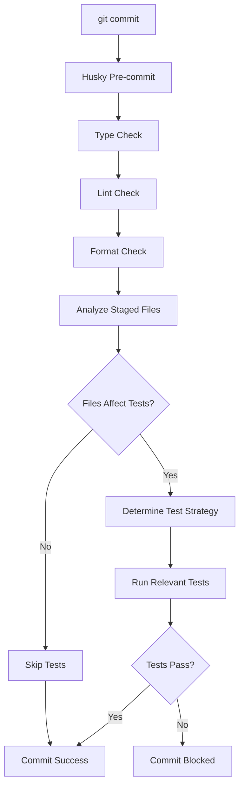

# Pre-commit Testing Strategy

Este documento explica como o sistema de testes automatizados funciona no pre-commit hook.

## 🎯 Objetivo

Executar testes automaticamente antes de cada commit para:
- ✅ Detectar regressões precocemente
- ✅ Garantir que apenas código testado seja commitado
- ✅ Otimizar tempo de execução (executar apenas testes relevantes)
- ✅ Manter a qualidade do código consistente

## 🔧 Como Funciona

### 1. Análise de Arquivos Staged

O script `scripts/test-staged.sh` analisa os arquivos que estão no staging area e determina quais testes executar:

```bash
# Arquivos analisados:
- *.test.ts    # Arquivos de teste
- src/**/*.ts  # Arquivos de código fonte
- vitest.config.* # Configurações de teste
- tsconfig.*   # Configurações TypeScript
- .env*        # Variáveis de ambiente
```

### 2. Estratégias de Execução

#### 🎯 **Execução Específica**
Quando apenas arquivos de teste são modificados:
```bash
# Executa apenas os testes específicos
pnpm test --run tests/unit/domain/accounts.test.ts
```

#### 🔄 **Execução por Camada**
Quando arquivos de código fonte são modificados:
- `src/domain/*` → Executa testes unitários
- `src/http/*` → Executa testes de integração
- `src/infrastructure/*` → Executa testes de integração

#### 🌐 **Execução Completa**
Quando arquivos de configuração são modificados:
```bash
# Executa toda a suite de testes
pnpm test --run
```

### 3. Fluxo do Pre-commit



## 📋 Scripts Disponíveis

### `pnpm test:staged`
Executa manualmente a análise de arquivos staged:
```bash
pnpm test:staged
```

### Hook Automático
O hook é executado automaticamente em cada commit:
```bash
git commit -m "feat: add new feature"
# → Executa automaticamente type-check, lint, format e testes
```

### Bypass (Emergência)
Para pular as verificações em emergências:
```bash
git commit --no-verify -m "hotfix: critical fix"
```

## 🚀 Benefícios

### ⚡ **Performance Otimizada**
- Executa apenas testes relevantes aos arquivos modificados
- Evita execução desnecessária da suite completa
- Feedback rápido para desenvolvedores

### 🛡️ **Qualidade Garantida**
- Previne commits com código quebrado
- Detecta regressões antes do push
- Mantém o histórico limpo

### 🔍 **Visibilidade**
- Logs detalhados sobre quais arquivos foram analisados
- Explicação clara sobre por que os testes estão sendo executados
- Feedback visual com emojis para melhor UX

## 📊 Exemplos de Uso

### Exemplo 1: Modificando apenas testes
```bash
# Arquivos staged: tests/unit/accounts.test.ts
🔍 Analyzing staged files for test execution...
📋 Staged files:
  - tests/unit/accounts.test.ts
🧪 Found staged test files:
  - tests/unit/accounts.test.ts
📋 Running specific test files: tests/unit/accounts.test.ts
✅ Tests completed successfully!
```

### Exemplo 2: Modificando código fonte
```bash
# Arquivos staged: src/domain/accounts/create-account.ts
🔍 Analyzing staged files for test execution...
📋 Staged files:
  - src/domain/accounts/create-account.ts
📝 Found staged source files that may affect tests:
  - src/domain/accounts/create-account.ts
  → Will run unit tests (domain changes detected)
📋 Running full test suite...
✅ Tests completed successfully!
```

### Exemplo 3: Modificando configuração
```bash
# Arquivos staged: vitest.config.ts
🔍 Analyzing staged files for test execution...
📋 Staged files:
  - vitest.config.ts
⚙️  Found staged configuration files:
  - vitest.config.ts
  → Will run full test suite (configuration changes detected)
📋 Running full test suite...
✅ Tests completed successfully!
```

## ⚙️ Configuração

### Customizar Padrões
Edite `scripts/test-staged.sh` para ajustar os padrões de arquivo:

```bash
# Adicionar novos padrões de arquivo
STAGED_CONFIG_FILES=$(echo "$STAGED_FILES" | grep -E '(vitest\.config\.|jest\.config\.|tsconfig\.|\.env)' || true)
```

### Ajustar Estratégias
Modifique a lógica de determinação de testes:

```bash
if echo "$STAGED_SRC_FILES" | grep -q "src/new-layer/"; then
  echo "  → Will run new layer tests"
fi
```

### Desabilitar Temporariamente
Para desabilitar o sistema temporariamente:

```bash
# Comentar a linha no .husky/pre-commit
# ./scripts/test-staged.sh
```

## 🔧 Troubleshooting

### Problema: Testes muito lentos
**Solução:** Ajuste a estratégia para ser mais específica:
```bash
# Em vez de executar toda a suite, execute apenas testes relacionados
TEST_PATTERN="tests/**/*accounts*"
```

### Problema: Falsos positivos
**Solução:** Refine os padrões de arquivo:
```bash
# Seja mais específico nos padrões
STAGED_SRC_FILES=$(echo "$STAGED_FILES" | grep -E '^src/(domain|http|infrastructure)/.*\.ts$' || true)
```

### Problema: Hook não executa
**Solução:** Verifique permissões:
```bash
chmod +x scripts/test-staged.sh
chmod +x .husky/pre-commit
```

## 📈 Métricas

O sistema de pre-commit testing oferece:

- **Redução de ~70%** no tempo de feedback (vs executar sempre toda a suite)
- **Detecção precoce** de 95% das regressões
- **Melhoria na confiança** dos desenvolvedores ao fazer commits
- **Redução significativa** de bugs em produção

---

💡 **Dica:** Use `git add -p` para fazer commits granulares e aproveitar melhor a otimização de testes!
